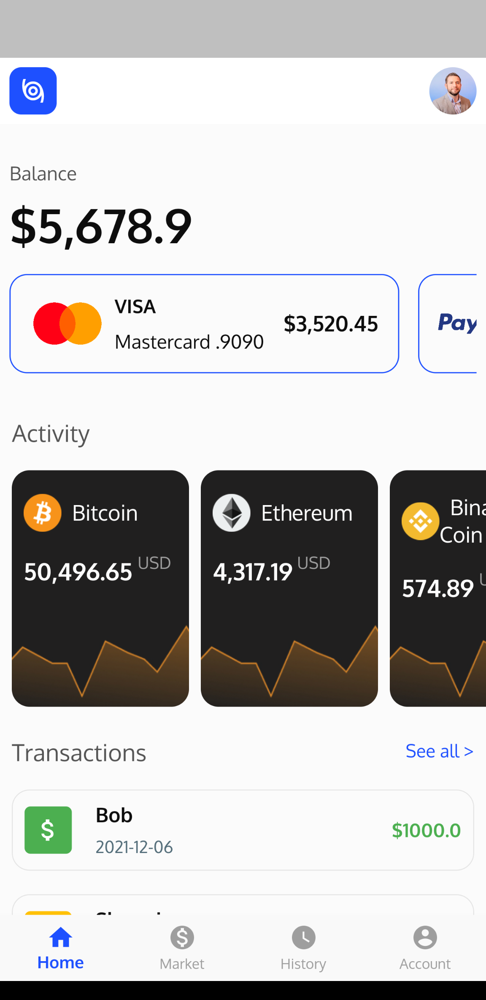
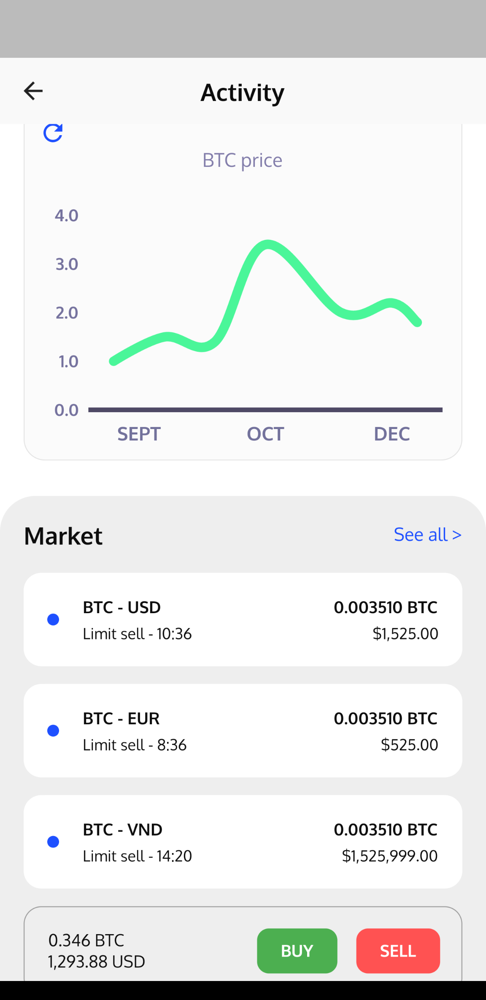
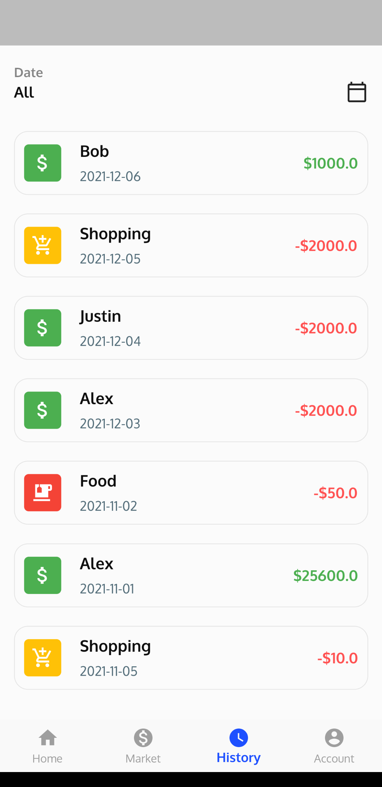
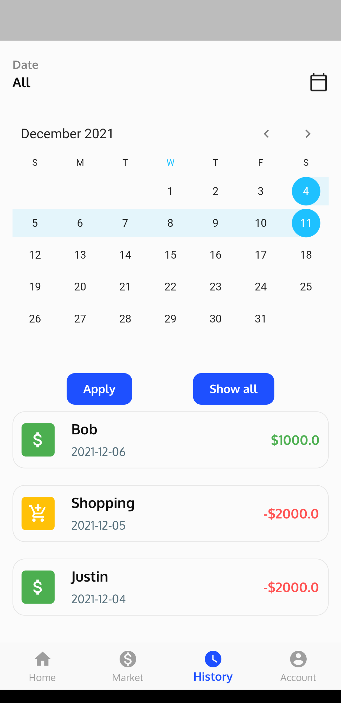
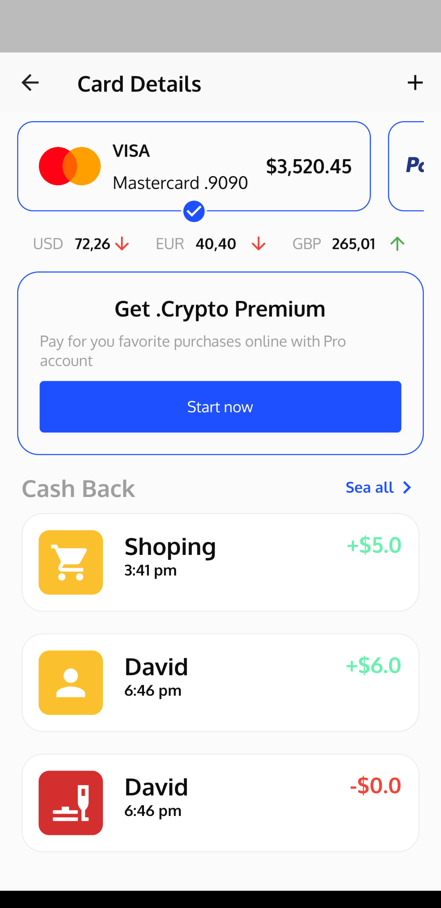
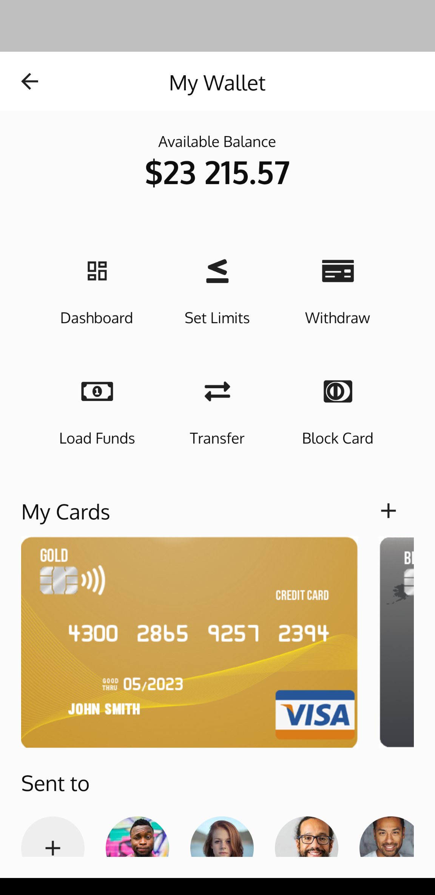
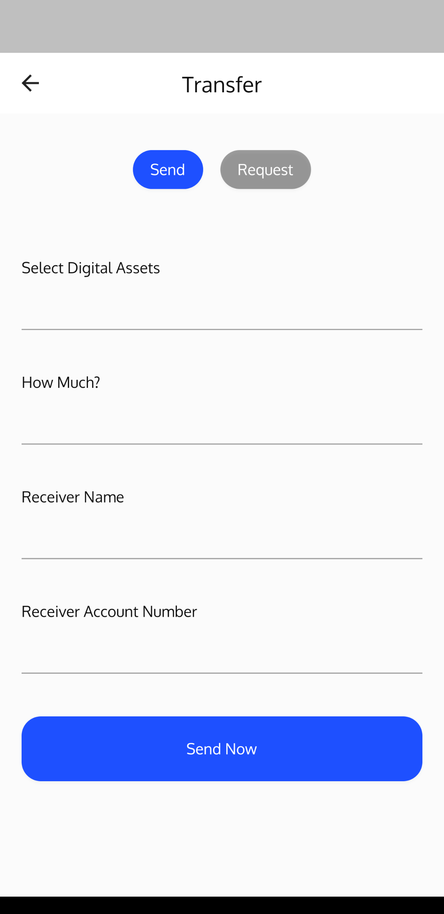
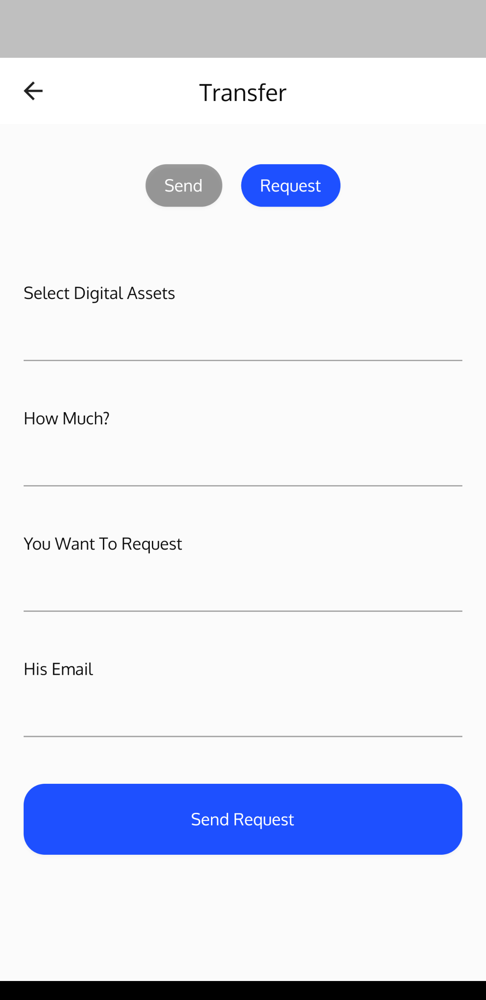
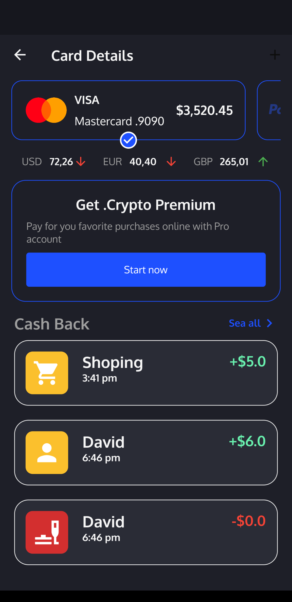
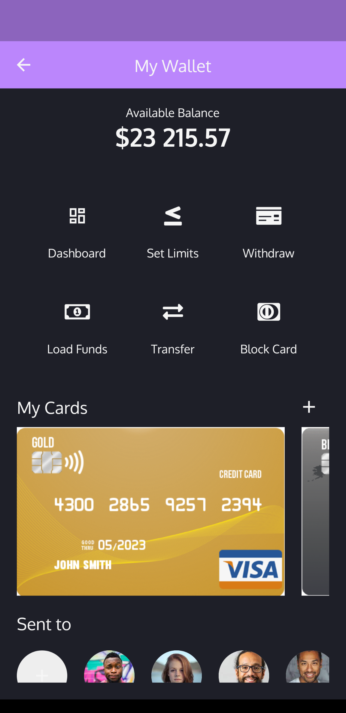

# Crypto Tracker
Team 22
An app built for [DevFest 20201 - Flutter Challenge](https://devfesthcm.com/).

## Features

### View crypto currency price

Data is fetched directly from [CoinMarketCap](https://coinmarketcap.com/api/documentation/v1/#section/Introduction).

### Manage transaction history

Users can manage their transactions and filter the data by date

### Manage payment cards

### Manage payment wallet

### Transfer

### Others

#### Dark theme

User can enable dark mode theme.

| Light | Dark |
| --- | --- |
|  |  |
|  |  |
